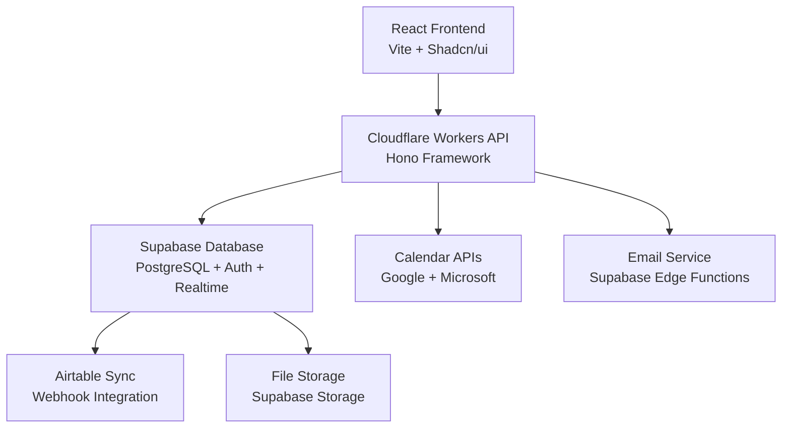

# CF Office Hours Platform

**Intelligent mentor-mentee matching and scheduling platform for Capital Factory's startup accelerator program.**

The CF Office Hours Platform revolutionizes how entrepreneurs connect with experienced mentors. Built to replace Union.vc, this platform uses AI-powered matching algorithms to connect mentees with the most relevant mentors based on industry expertise, company stage alignment, and reputation-based access tiers.

## 🎯 What It Does

### For Mentees (Entrepreneurs)
- **Smart Matching**: AI-powered recommendations connect you with mentors who best match your industry, technology stack, and business stage
- **Seamless Booking**: Browse available time slots, book meetings, and receive Google Meet links automatically
- **Profile Management**: Upload pitch decks, link your startup profiles, and showcase your expertise
- **Reputation-Based Access**: Build your reputation through successful meetings to unlock higher-tier mentors

### For Mentors
- **Intelligent Scheduling**: Set recurring availability with flexible time slots and buffer management
- **Meeting Requests**: Receive booking requests from qualified mentees with context about their goals
- **Calendar Integration**: Automatically sync with Google Calendar or Microsoft Outlook
- **Expertise Showcase**: Define your expertise areas and ideal mentee profiles for better matching

### For Coordinators (Admins)
- **User Management**: Oversee all users, manage access permissions, and handle tier overrides
- **Quality Control**: Approve user-submitted tags and monitor platform health
- **Analytics Dashboard**: Track platform usage, meeting success rates, and user engagement
- **Content Moderation**: Review and approve user profiles, tags, and meeting feedback

## 🏗️ Architecture Overview

This is a modern fullstack application with a carefully designed architecture for scalability and maintainability:



## 📚 Complete Documentation

### 🚀 Quick Start Guides
- **[Development Setup](docs/architecture/10-development-workflow.md)** - Complete local development environment setup
- **[Deployment Guide](docs/deployment/DEPLOYMENT_INSTRUCTIONS.md)** - Production deployment instructions
- **[Troubleshooting](docs/TROUBLESHOOTING.md)** ⭐ - Common issues and solutions

### 📋 Product Documentation
- **[Product Requirements (PRD)](docs/prd/index.md)** - Detailed functional and non-functional requirements
- **[User Stories](docs/stories/)** - Complete feature breakdown by implementation order
- **[UI Enhancement Goals](docs/prd/3-ui-enhancement-goals.md)** - Design system and user experience specifications

### 🏛️ Technical Architecture
- **[Complete Architecture Guide](docs/architecture/index.md)** - Full technical architecture documentation
- **[High-Level Architecture](docs/architecture/2-high-level-architecture.md)** - System overview and design principles
- **[Frontend Architecture](docs/architecture/7-frontend-architecture.md)** - React application structure and patterns
- **[Backend Architecture](docs/architecture/8-backend-architecture.md)** - Cloudflare Workers API design
- **[Data Models](docs/architecture/4-data-models.md)** - Database schema and relationships
- **[API Specification](docs/architecture/5-api-specification.md)** - Complete API endpoint documentation

### 🔧 Development Resources
- **[Coding Standards](docs/architecture/14-coding-standards.md)** - Code style and best practices
- **[Testing Strategy](docs/architecture/13-testing-strategy.md)** - Unit, integration, and E2E testing approach
- **[Error Handling](docs/architecture/15-error-handling-strategy.md)** - Centralized error management
- **[Monitoring & Observability](docs/architecture/16-monitoring-and-observability.md)** - Logging and performance monitoring

### 🚢 Deployment & Operations
- **[Deployment Architecture](docs/architecture/11-deployment-architecture.md)** - Infrastructure and deployment strategy
- **[Security & Performance](docs/architecture/12-security-and-performance.md)** - Security measures and performance optimization
- **[Production Runbook](docs/deployment/supabase-production-runbook.md)** - Production operations guide
- **[Launch Checklist](docs/deployment/production-launch-checklist.md)** - Pre-launch verification steps

### 🧪 Quality Assurance
- **[Manual Test Checklist](docs/qa/0.16.1-manual-test-checklist.md)** - Comprehensive testing procedures
- **[Test Gates](docs/qa/gates/)** - Automated quality gates for each feature
- **[Sprint Proposals](docs/sprint-change-proposal-2025-10-06.md)** - Current development priorities

## 🛠️ Technical Stack

| Component | Technology | Purpose |
|-----------|------------|---------|
| **Frontend** | React 18.3.x + Vite 5.x | User interface and client-side logic |
| **UI Framework** | Shadcn/ui + Tailwind CSS 3.4.x | Consistent design system |
| **Backend** | Cloudflare Workers + Hono 4.x | Serverless API and business logic |
| **Database** | Supabase (PostgreSQL) | Data storage, auth, and real-time features |
| **Authentication** | Supabase Auth | Magic links + OAuth (Google/Microsoft) |
| **File Storage** | Supabase Storage | Document and media management |
| **Real-time** | Supabase Realtime | Live updates and notifications |
| **Calendar Integration** | Google Calendar + Microsoft Outlook | Scheduling and availability |
| **External Data** | Airtable Webhooks | User and taxonomy data sync |
| **Testing** | Vitest 3.x + Playwright 1.50.x+ | Unit and end-to-end testing |
| **Monorepo** | npm workspaces | Package management and orchestration |

## 🏗️ Project Structure

```
cf-office-hours/
├── apps/
│   ├── web/                    # React frontend (Cloudflare Pages)
│   │   ├── src/
│   │   │   ├── components/     # Reusable UI components
│   │   │   ├── pages/          # Route components
│   │   │   ├── hooks/          # Custom React hooks
│   │   │   └── lib/            # Utilities and services
│   │   └── public/             # Static assets
│   └── api/                    # Cloudflare Workers API
│       ├── src/
│       │   ├── routes/         # API endpoints
│       │   ├── middleware/     # Authentication & validation
│       │   ├── services/       # Business logic
│       │   └── lib/            # Shared utilities
│       └── dist/               # Built API bundle
├── packages/
│   ├── shared/                 # Shared types, schemas, utilities
│   └── config/                 # ESLint, TypeScript, and build configs
├── docs/                       # Comprehensive documentation
│   ├── architecture/           # Technical architecture docs
│   ├── prd/                   # Product requirements
│   ├── deployment/            # Deployment and operations
│   ├── qa/                    # Quality assurance and testing
│   └── stories/               # User stories and features
├── scripts/                    # Build and utility scripts
├── supabase/                   # Database migrations and seeds
└── node_modules/              # Dependencies (monorepo)
```

## 🚀 Development Commands

```bash
# Environment Setup
npm run setup                   # Initial project setup
npm install                     # Install all dependencies

# Development Servers
npm run dev                     # Start all services
npm run dev:web                 # Start frontend only
npm run dev:api                 # Start backend only

# Building & Deployment
npm run build                   # Build all packages
npm run build:web               # Build frontend for production
npm run build:api               # Build API for deployment

# Testing
npm run test                    # Run all tests
npm run test:web                # Run frontend tests
npm run test:api                # Run API tests
npm run test:e2e                # Run end-to-end tests

# Code Quality
npm run lint                    # Check code quality
npm run lint:fix                # Auto-fix linting issues
npm run format                  # Format all code files
npm run type-check              # TypeScript type checking

# Database & Data
npm run generate:api-types      # Generate TypeScript types from API
npm run populate-match-cache    # Populate AI matching cache

# Maintenance
npm run clean                   # Remove all node_modules and build artifacts
```

## 🔧 Environment Configuration

1. **Copy environment templates:**
   ```bash
   cp apps/web/.env.example apps/web/.env
   cp apps/api/.env.example apps/api/.env
   ```

2. **Configure required services:**
   - **Supabase**: Project URL and API keys
   - **Cloudflare**: Account ID and API tokens
   - **OAuth Providers**: Google and Microsoft credentials
   - **Email Service**: SMTP or email provider settings

3. **Environment variables by service:**
   ```bash
   # Frontend (.env)
   VITE_SUPABASE_URL=your_supabase_url
   VITE_SUPABASE_ANON_KEY=your_anon_key

   # API (.env)
   SUPABASE_URL=your_supabase_url
   SUPABASE_SERVICE_ROLE_KEY=your_service_key
   CLOUDFLARE_ACCOUNT_ID=your_account_id
   ```

## 🎯 Key Features

### 🤖 AI-Powered Matching
- **Tag-based scoring** with industry, technology, and stage alignment
- **Reputation tiers** controlling mentor access levels
- **Cached calculations** for sub-100ms response times
- **Match explanations** showing why mentors are recommended
- **Pluggable algorithms** via `IMatchingEngine` interface supporting multiple algorithms simultaneously for A/B testing and gradual rollouts

### 📅 Advanced Scheduling
- **Multi-provider calendar integration** (Google Calendar, Microsoft Outlook)
- **Recurring availability** with flexible time slot management
- **Automatic conflict prevention** across all calendar providers
- **Google Meet integration** with automatic link generation

### 🔐 Enterprise-Grade Security
- **Row-level security (RLS)** policies on all database tables
- **OAuth-first authentication** with calendar permission scoping
- **Email-based access control** synced from Airtable
- **Comprehensive audit logging** for all user actions

### 📊 Data Integration
- **Airtable webhook sync** for user and taxonomy data
- **Automated data seeding** with CSV import capabilities
- **Real-time data validation** and normalization
- **ETL workflow support** for ongoing data management

## 🏗️ Architecture Patterns

### Interface-Driven Design
The platform leverages **interface-based architecture** enabling sophisticated engineering practices:

- **`IMatchingEngine` Interface**: Supports multiple AI matching algorithms simultaneously through a pluggable design
- **A/B Testing**: Different algorithms can run in parallel with algorithm versions stored as data for controlled rollouts
- **Gradual Migration**: New matching algorithms can be deployed incrementally without system downtime
- **Performance Optimization**: Match calculations are event-driven and cached for sub-100ms response times

### Provider Pattern Architecture
- **`ICalendarProvider` Interface**: Abstracts calendar integrations (Google Calendar, Microsoft Outlook)
- **`INotificationProvider` Interface**: Enables multiple notification channels (email, SMS, push)
- **`IReputationCalculator` Interface**: Pluggable reputation scoring algorithms

### Event-Driven Architecture
- **Webhook Integration**: Real-time data sync from Airtable via webhook-triggered Cloudflare Workers
- **Background Processing**: Match recalculation and notification delivery handled asynchronously
- **Cache Invalidation**: Smart cache management ensuring data consistency across algorithm updates

## 🎨 Development Philosophy

This project follows a **documentation-driven development** approach where all decisions, requirements, and architectural choices are thoroughly documented before implementation. The comprehensive documentation serves as:

- **Single source of truth** for all technical decisions
- **Onboarding guide** for new team members
- **Quality assurance** framework ensuring consistent implementation
- **Living architecture** that evolves with the codebase
