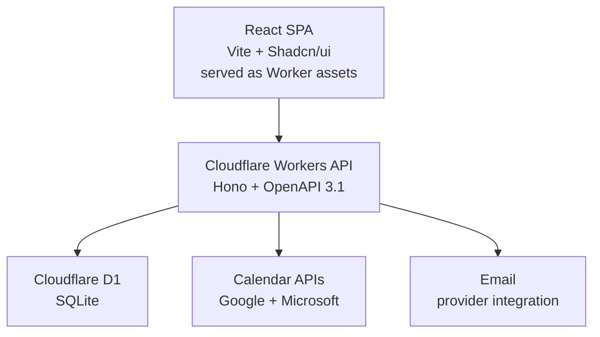

# CF Office Hours Platform

> **Project Overview:** See [PROJECT.md](PROJECT.md) for a high-level overview, achievements, and technical highlights.

**Intelligent mentor-mentee matching and scheduling platform for a startup accelerator program.**

The platform connects entrepreneurs with experienced mentors using AI-powered matching algorithms based on industry
expertise, company stage alignment, and reputation-based access tiers, replacing a legacy scheduling tool.

## 🎯 What It Does

### For Mentees (Entrepreneurs)

- **Smart Matching**: AI-powered recommendations connect you with mentors who best match your industry, technology
  stack, and business stage
- **Seamless Booking**: Browse available time slots, book meetings, and receive Google Meet links automatically
- **Profile Management**: Upload pitch decks, link your startup profiles, and showcase your expertise
- **Reputation-Based Access**: Build your reputation through successful meetings to unlock higher-tier mentors

### For Mentors

- **Intelligent Scheduling**: Set recurring availability with flexible time slots and buffer management
- **Meeting Requests**: Receive booking requests from qualified mentees with context about their goals
- **Calendar Integration**: Automatically sync with Google Calendar or Microsoft Outlook
- **Expertise Showcase**: Define your expertise areas and ideal mentee profiles for better matching

### For Coordinators (Admins)

- **User Management**: Oversee all users, manage access permissions, and handle tier overrides
- **Quality Control**: Approve user-submitted tags and monitor platform health
- **Analytics Dashboard**: Track platform usage, meeting success rates, and user engagement
- **Content Moderation**: Review and approve user profiles, tags, and meeting feedback

## 🏗️ Architecture Overview

A modern fullstack application running entirely on Cloudflare:


```mermaid
graph TB
    A[React SPA<br/>Vite + Shadcn/ui<br/>served as Worker assets] --> B[Cloudflare Workers API<br/>Hono + OpenAPI 3.1]
    B --> C[Cloudflare D1<br/>SQLite]
    B --> E[Calendar APIs<br/>Google + Microsoft]
    B --> F[Email<br/>provider integration]
```

Authentication is a Worker-issued session JWT (verified locally with `jose`); the SPA signs in via role-based demo
login. Live booking updates come from React Query polling.

## 📚 Complete Documentation

### 🚀 Quick Start Guides

- **[Development Setup](docs/architecture/10-development-workflow.md)** - Local development environment setup
- **[Deployment Guide](docs/deployment/DEPLOYMENT_INSTRUCTIONS.md)** - Deployment instructions
- **[Troubleshooting](docs/TROUBLESHOOTING.md)** ⭐ - Common issues and solutions

### 📋 Product Documentation

- **[Product Requirements (PRD)](docs/prd/index.md)** - Functional and non-functional requirements
- **[User Stories](docs/stories/)** - Feature breakdown by implementation order

### 🏛️ Technical Architecture

- **[Complete Architecture Guide](docs/architecture/index.md)** - Full technical architecture documentation
- **[Backend Architecture](docs/architecture/8-backend-architecture.md)** - Cloudflare Workers API design
- **[API Specification](docs/architecture/5-api-specification.md)** - API endpoint documentation

> **Note:** some pages under `docs/` describe a Supabase/Pages stack that does not reflect the current Cloudflare D1 +
> Workers implementation.

## 🛠️ Technical Stack

| Component                | Technology                          | Purpose                              |
| ------------------------ | ----------------------------------- | ------------------------------------ |
| **Frontend**             | React 18.3.x + Vite 5.x             | User interface and client-side logic |
| **UI Framework**         | Shadcn/ui + Tailwind CSS 3.4.x      | Consistent design system             |
| **Backend**              | Cloudflare Workers + Hono 4.x       | Serverless API and business logic    |
| **Database**             | Cloudflare D1 (SQLite)              | Data storage                         |
| **Authentication**       | Worker-issued session JWT (`jose`)  | Role-based demo login                |
| **Web hosting**          | Cloudflare Workers static assets    | SPA delivery                         |
| **Live updates**         | React Query polling                 | Booking freshness                    |
| **Calendar Integration** | Google Calendar + Microsoft Outlook | Scheduling and availability          |
| **Testing**              | Vitest 3.x + Playwright 1.50.x      | Unit and end-to-end testing          |
| **Monorepo**             | npm workspaces                      | Package management and orchestration |

## 🏗️ Project Structure

```
cf-office-hours/
├── apps/
│   ├── web/                    # React frontend (Cloudflare Workers static assets)
│   │   ├── src/
│   │   │   ├── components/     # Reusable UI components
│   │   │   ├── pages/          # Route components
│   │   │   ├── hooks/          # Custom React hooks
│   │   │   └── lib/            # Utilities and services
│   │   └── public/             # Static assets
│   └── api/                    # Cloudflare Workers API
│       ├── src/
│       │   ├── routes/         # API endpoints
│       │   ├── middleware/     # Authentication & validation
│       │   ├── services/       # Business logic
│       │   └── lib/            # Shared utilities
│       ├── migrations/         # D1 (SQLite) schema migrations
│       └── seeds/              # D1 seed data (generated; gitignored)
├── packages/
│   ├── shared/                 # Shared types, schemas, utilities
│   └── config/                 # ESLint, TypeScript, and build configs
├── docs/                       # Documentation
├── scripts/                    # Build and utility scripts
└── node_modules/              # Dependencies (monorepo)
```

## 🚀 Development Commands

```bash
# Environment Setup
npm run setup                   # Initial project setup
npm install                     # Install all dependencies

# Development Servers
npm run dev                     # Start all services
npm run dev:web                 # Start frontend only
npm run dev:api                 # Start backend only (wrangler dev, local D1)

# Building & Deployment
npm run build                   # Build all packages
npm run build:web               # Build frontend for production
npm run build:api               # Build API for deployment

# Testing
npm run test                    # Run all tests
npm run test:web                # Run frontend tests
npm run test:api                # Run API tests
npm run test:e2e                # Run end-to-end tests

# Code Quality
npm run lint                    # Check code quality
npm run lint:fix                # Auto-fix linting issues
npm run format                  # Format all code files
npm run type-check              # TypeScript type checking

# Data
npm run generate:api-types      # Generate TypeScript types from the API OpenAPI spec
```

## 🔧 Environment Configuration

The web reads `VITE_API_BASE_URL` at **build time** (baked into the bundle by the `build:staging` / `build:production`
scripts). The API reads `JWT_SECRET` at runtime; deploys read a Cloudflare API token.

```bash
# Web build-time (or apps/web/.env for local dev)
VITE_API_BASE_URL=http://127.0.0.1:8787

# API local secret (apps/api/.dev.vars)
JWT_SECRET=your-local-jwt-secret

# Deploy (environment, never committed)
CLOUDFLARE_API_TOKEN=...
CLOUDFLARE_ACCOUNT_ID=...
```

Seed a local D1 database:

```bash
cd apps/api
npx wrangler d1 migrations apply cf-office-hours --local
npx wrangler d1 execute cf-office-hours --local --file=seeds/d1_seed.sql
```

## 🎯 Key Features

### 🤖 AI-Powered Matching

- **Tag-based scoring** with industry, technology, and stage alignment
- **Reputation tiers** controlling mentor access levels
- **Cached calculations** for sub-100ms response times
- **Match explanations** showing why mentors are recommended
- **Pluggable algorithms** via the `IMatchingEngine` interface, supporting multiple algorithms simultaneously for A/B
  testing and gradual rollouts

### 📅 Advanced Scheduling

- **Multi-provider calendar integration** (Google Calendar, Microsoft Outlook)
- **Recurring availability** with flexible time slot management
- **Automatic conflict prevention** via an atomic booking transaction (UNIQUE slot guard)
- **Google Meet integration** with automatic link generation

### 🔐 Security

- **App-layer authorization** with role checks (mentee / mentor / coordinator) enforced in API middleware
- **Worker-signed session JWTs** (HS256 via `jose`), verified locally on every request
- **Audit columns** (`created_by` / `updated_by` / soft-delete) on records

## 🏗️ Architecture Patterns

### Interface-Driven Design

- **`IMatchingEngine` Interface**: supports multiple AI matching algorithms simultaneously through a pluggable design
- **A/B Testing**: different algorithms run in parallel with the algorithm version stored as data
- **Gradual Migration**: new algorithms deploy incrementally without downtime
- **Performance Optimization**: match calculations are event-driven and cached for sub-100ms retrieval

### Provider Pattern Architecture

- **`ICalendarProvider` Interface**: abstracts calendar integrations (Google Calendar, Microsoft Outlook)
- **`INotificationProvider` Interface**: enables multiple notification channels (email, SMS, push)
- **`IReputationCalculator` Interface**: pluggable reputation scoring algorithms

### Event-Driven Architecture

- **Background Processing**: match recalculation and notification delivery handled asynchronously
- **Cache Invalidation**: smart cache management ensuring data consistency across algorithm updates

## 🎨 Development Philosophy

This project follows a **documentation-driven development** approach where decisions, requirements, and architectural
choices are documented before implementation. The documentation serves as:

- **Single source of truth** for technical decisions
- **Onboarding guide** for new contributors
- **Quality assurance** framework ensuring consistent implementation
- **Living architecture** that evolves with the codebase
