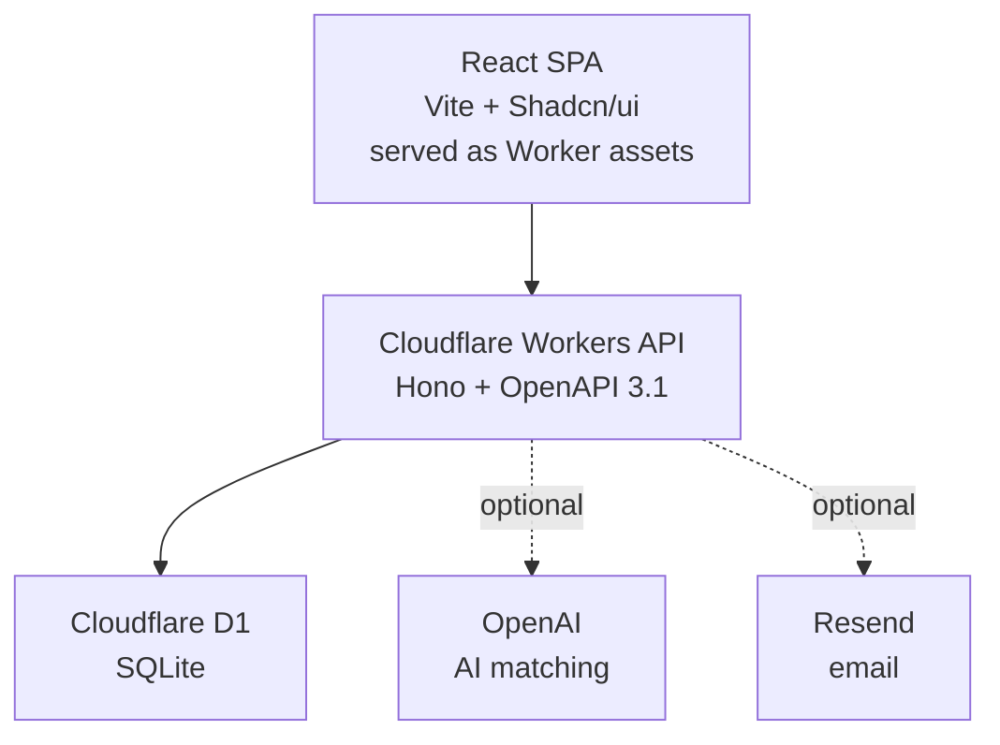

# CF Office Hours Platform

> **Project Overview:** See [PROJECT.md](PROJECT.md) for a high-level summary, achievements, and technical highlights.

**Intelligent mentor-mentee matching and scheduling platform for a startup accelerator program.**

The platform connects entrepreneurs with experienced mentors using matching based on industry expertise, company-stage
alignment, and reputation-based access tiers.

## What It Does

### For Mentees (Entrepreneurs)

- **Smart Matching**: recommendations connect you with mentors who fit your industry, technology, and business stage.
- **Booking**: browse available time slots and book meetings.
- **Profile Management**: maintain your profile and link your startup details.
- **Reputation-Based Access**: build reputation through successful meetings to reach higher-tier mentors.

### For Mentors

- **Availability**: set bookable availability blocks with flexible slot durations.
- **Meeting Requests**: receive booking requests from mentees with context on their goals.
- **Expertise Showcase**: describe your expertise and ideal mentee profile to improve matching.

### For Coordinators (Admins)

- **User Management**: oversee users and handle reputation-tier overrides.
- **Quality Control**: approve user-submitted tags and review matches.
- **Metrics**: track platform usage through coordinator dashboards.

## Architecture Overview

A fullstack application running entirely on Cloudflare:


```mermaid
graph TB
    A[React SPA<br/>Vite + Shadcn/ui<br/>served as Worker assets] --> B[Cloudflare Workers API<br/>Hono + OpenAPI 3.1]
    B --> C[Cloudflare D1<br/>SQLite]
    B -.optional.-> D[OpenAI<br/>AI matching]
    B -.optional.-> E[Resend<br/>email]
```

Authentication is a Worker-issued session JWT (verified locally with `jose`); the SPA signs in via role-based demo
login. Live booking updates come from React Query polling.

## Documentation

### Guides

- **[Deployment Guide](docs/deployment/DEPLOYMENT_INSTRUCTIONS.md)** — deploying the API and web Workers.
- **[Troubleshooting](docs/TROUBLESHOOTING.md)** — common issues and fixes.
- Per-app setup: [`apps/api`](apps/api/README.md) and [`apps/web`](apps/web/README.md).

### Engineering Documentation

Detailed engineering docs live under `docs/` on the `dev` branch and are not published to `main`: the architecture is
documented in [`docs/architecture/`](docs/architecture/index.md). The original product requirements, implementation
stories, and QA gates are preserved as a frozen historical record under [`docs/archive/`](docs/archive/).

## Technical Stack

| Component          | Technology                         | Purpose                              |
| ------------------ | ---------------------------------- | ------------------------------------ |
| **Frontend**       | React 18.3.x + Vite 5.x            | User interface and client-side logic |
| **UI Framework**   | Shadcn/ui + Tailwind CSS 3.4.x     | Consistent design system             |
| **Backend**        | Cloudflare Workers + Hono 4.x      | Serverless API and business logic    |
| **Database**       | Cloudflare D1 (SQLite)             | Data storage                         |
| **Authentication** | Worker-issued session JWT (`jose`) | Role-based demo login                |
| **Web hosting**    | Cloudflare Workers static assets   | SPA delivery                         |
| **Live updates**   | React Query polling                | Booking freshness                    |
| **AI**             | OpenAI (optional)                  | AI-based matching engine             |
| **Email**          | Resend (optional)                  | Booking-confirmation email           |
| **Testing**        | Vitest 3.x + Playwright 1.50.x     | Unit and end-to-end testing          |
| **Monorepo**       | npm workspaces                     | Package management and orchestration |

## Project Structure

```text
cf-office-hours/
├── apps/
│   ├── web/                    # React frontend (Cloudflare Workers static assets)
│   │   ├── worker/             # static-assets Worker entry
│   │   └── src/                # components, pages, hooks, services, stores, lib
│   └── api/                    # Cloudflare Workers API
│       ├── src/                # routes, middleware, services, repositories, providers, events
│       ├── migrations/         # D1 (SQLite) schema migrations
│       └── seeds/              # D1 seed data (generated; gitignored)
├── packages/
│   ├── shared/                 # Shared Zod schemas and types
│   └── config/                 # ESLint, TypeScript, and build configs
├── docs/                       # Documentation
├── scripts/                    # Build and utility scripts
└── node_modules/               # Dependencies (monorepo)
```

## Development Commands

```bash
# Setup
npm install                     # Install all dependencies

# Development servers
npm run dev                     # Start all services
npm run dev:web                 # Frontend only
npm run dev:api                 # API only (wrangler dev, local D1)

# Build
npm run build                   # Build all packages
npm run build:web               # Build frontend
npm run build:api               # Build API

# Testing
npm run test                    # Run all tests
npm run test:web                # Frontend tests
npm run test:api                # API tests
npm run test:e2e                # End-to-end tests

# Code quality
npm run lint                    # Check code quality
npm run format                  # Format all code
npm run type-check              # TypeScript type checking

# Data
npm run generate:api-types      # Generate TypeScript types from the API OpenAPI spec
```

## Environment Configuration

The web reads `VITE_API_BASE_URL` at **build time** (baked into the bundle by the `build:staging` / `build:production`
scripts). The API reads `JWT_SECRET` at runtime; deploys read a Cloudflare API token.

```bash
# Web build-time (or apps/web/.env for local dev) — no /v1 suffix
VITE_API_BASE_URL=http://127.0.0.1:8787

# API local secret (apps/api/.dev.vars)
JWT_SECRET=your-local-jwt-secret

# Deploy (environment, never committed)
CLOUDFLARE_API_TOKEN=...
CLOUDFLARE_ACCOUNT_ID=...
```

Seed a local D1 database:

```bash
cd apps/api
npx wrangler d1 migrations apply cf-office-hours --local
npx wrangler d1 execute cf-office-hours --local --file=seeds/d1_seed.sql
```

The seed is self-correcting: a footer in the generated file shapes the bookings to a realistic per-mentee count and
anchors every date to load time, so no follow-up steps are needed. See `apps/api/seeds/README.md` for details.

## Features

### Shipped

- **AI-powered matching** — tag-based (`tag-based-v1`) and AI-based (`ai-based-v1`) engines, with cached calculations
  for sub-100ms retrieval and stored match explanations. Algorithms are pluggable via the `IMatchingEngine` interface,
  so multiple versions coexist for A/B testing and gradual rollout.
- **Role-based demo login** — Worker-signed session JWTs (HS256 via `jose`), verified locally on each request.
- **App-layer authorization** — role checks (mentee / mentor / coordinator) enforced in API middleware.
- **Scheduling** — mentor availability with flexible slot durations, and an atomic booking transaction (UNIQUE slot
  guard) that prevents double-booking.
- **React Query polling** — keeps bookings and availability current without a real-time socket layer.
- **Weekly cron** — a Cron Trigger re-anchors the demo seed's dates so the upcoming-meetings window never drifts.
- **Email** — booking-confirmation email via Resend (logs to console when the key is unset).
- **Metrics** — request, error, and CPU metrics via the Cloudflare Workers dashboard.

### Roadmap (not yet implemented)

These are not in the codebase today:

- **OAuth and magic-link authentication** (sign-in is demo login only).
- **Calendar integration** (Google Calendar, Microsoft Outlook) and **Google Meet** link generation.
- **Additional notification channels** beyond email.

## Architecture Patterns

- **Interface-driven matching.** The `IMatchingEngine` interface lets multiple algorithms run in parallel; the algorithm
  version is stored as data, so new engines deploy incrementally without downtime.
- **Event-driven cache.** Match calculations are triggered by data-change events (profile, tag, and reputation updates)
  and written to a D1 cache table, so retrieval is a single indexed read.

## License

Dual-licensed under either of Apache License 2.0 or the MIT License, at your option.
