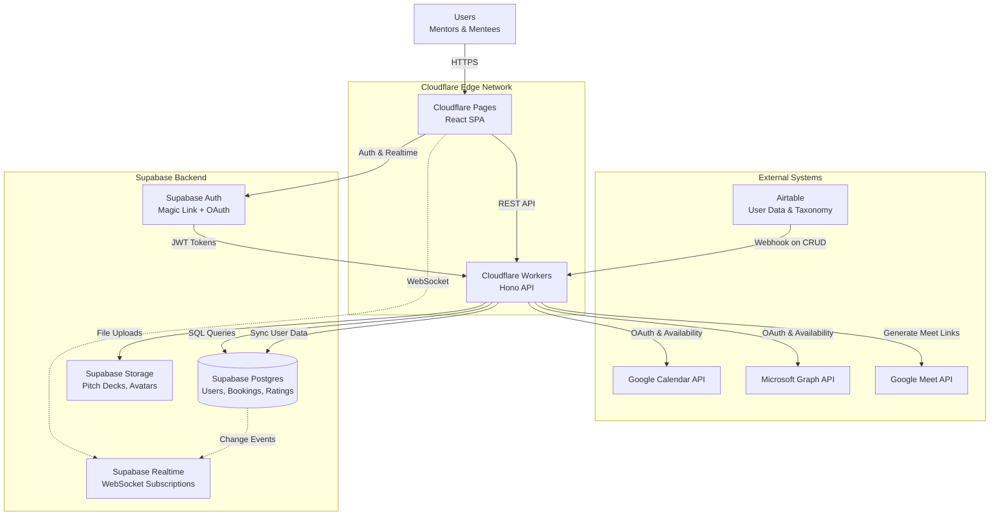

# 2. High Level Architecture

## 2.1 Technical Summary

The CF Office Hours Platform employs a **serverless Jamstack architecture** with edge-deployed APIs and centralized data management. The frontend is a React SPA hosted on Cloudflare Pages, communicating with RESTful APIs running on Cloudflare Workers at the edge. Supabase provides the operational database (Postgres), authentication layer, file storage, and real-time subscription infrastructure. The system maintains a **one-way data sync** from Airtable (source of truth for user management) via webhook-triggered Workers, while all booking, scheduling, and reputation logic lives exclusively in Supabase.

Calendar integrations (Google Calendar, Microsoft Outlook) use OAuth 2.0 flows to access user availability and create meeting events, with Google Meet links auto-generated for virtual sessions. The architecture emphasizes **interface-based modularity** for calendar providers, matching algorithms, reputation calculators, and notification delivery—enabling future extensibility without touching core business logic.

This design achieves the PRD's goals through: (1) **intelligent matching** via pluggable tag-based algorithms, (2) **reputation-driven access control** enforced at the database layer, (3) **real-time booking updates** via Supabase subscriptions, and (4) **seamless scheduling** through bi-directional calendar sync.

## 2.2 Platform and Infrastructure Choice

Based on the PRD's requirements for budget constraints (free tier only), scale (~500 users), and technical stack preferences, I've evaluated the following options:

**Option 1: Cloudflare Pages + Workers + Supabase** ⭐ **RECOMMENDED**
- **Pros:**
  - Workers have zero cold starts (V8 isolates vs containers)
  - Generous free tiers align perfectly (100k requests/day Workers, unlimited Pages bandwidth)
  - Edge deployment reduces latency globally
  - Supabase provides Postgres + Auth + Storage + Realtime in one platform
- **Cons:**
  - Workers have 10ms CPU limit (requires async patterns for heavy work)
  - Less mature ecosystem than AWS/Vercel
- **Cost:** $0/month for MVP scale

**Option 2: Vercel + Supabase**
- **Pros:**
  - Excellent DX for React apps
  - Simpler deployment pipeline
- **Cons:**
  - Serverless Functions have cold starts (300-600ms)
  - Free tier bandwidth limited to 100GB/month (vs unlimited on Cloudflare Pages)
  - Edge Functions cost more at scale
- **Cost:** $0/month initially, may exceed free tier with heavy pitch deck downloads

**Option 3: AWS (Amplify + Lambda + Cognito + RDS)**
- **Pros:**
  - Enterprise-grade reliability
  - Maximum flexibility
- **Cons:**
  - Complexity overkill for MVP
  - Free tier expires after 12 months
  - Requires significant DevOps expertise
- **Cost:** ~$50-100/month after free tier expires

**RECOMMENDATION:** **Option 1 (Cloudflare + Supabase)**
This combination maximizes free tier generosity, eliminates cold starts, and consolidates backend services into Supabase's unified platform—reducing integration complexity while staying within budget.

---

**Platform:** Cloudflare (Pages + Workers)
**Key Services:**
- **Cloudflare Pages:** Frontend hosting (React SPA)
- **Cloudflare Workers:** Serverless API endpoints (Hono framework)
- **Supabase Postgres:** Operational database with Row Level Security
- **Supabase Auth:** Magic link + OAuth (Google/Microsoft)
- **Supabase Storage:** Pitch decks, avatars, documents
- **Supabase Realtime:** WebSocket subscriptions for live slot updates
- **Airtable:** External source of truth (user data, taxonomy)
- **Google Calendar API / Microsoft Graph API:** Calendar integration

**Deployment Host and Regions:**
- **Frontend:** Global edge network via Cloudflare Pages (automatic)
- **API:** Cloudflare Workers edge network (300+ locations globally)
- **Database:** Supabase US East region (configurable)

## 2.3 Repository Structure

For a fullstack project of this size (~500 users, 3-5 AI agent developers), a **monorepo with npm workspaces** provides the optimal balance of simplicity and shared code benefits without heavy tooling overhead.

**Rationale:**
- **Shared TypeScript types** between frontend/backend (OpenAPI-generated from Zod schemas)
- **Single deployment pipeline** via GitHub Actions
- **Simplified dependency management** (one root `package.json`)
- **No monorepo tool complexity** (Turborepo/Nx overkill for 2-3 packages)

**Repository Details:**
- Single frontend app (no separate admin dashboard)
- No mobile app (responsive web design for mobile-friendly experience)

---

**Structure:** Monorepo
**Monorepo Tool:** npm workspaces (built-in, zero config)
**Package Organization:**
- `apps/web` - React frontend (Vite + Shadcn/ui)
- `apps/api` - Cloudflare Workers (Hono + Zod)
- `packages/shared` - Shared TypeScript types, constants, utilities
- `packages/config` - Shared ESLint, TypeScript, Prettier configs

## 2.4 High Level Architecture Diagram

## 2.5 Architectural Patterns

- **Jamstack Architecture:** Static frontend with serverless APIs - _Rationale: Optimal performance, global CDN distribution, and simplified scaling without server management_

- **Edge Computing:** API logic runs at Cloudflare edge locations - _Rationale: Reduces latency for geographically distributed users (mentors/mentees across time zones)_

- **Interface-Based Abstractions:** Calendar, Matching, Reputation, Notifications use dependency injection - _Rationale: PRD requirement (Section 1.8) enables swapping providers without touching business logic_

- **Event-Driven Sync:** Airtable webhooks trigger real-time data synchronization - _Rationale: Minimizes API calls, keeps data fresh only when changes occur_

- **Optimistic UI with Realtime Sync:** Frontend updates immediately, reconciles via Supabase Realtime - _Rationale: Prevents double-booking race conditions (NFR7) while maintaining snappy UX_

- **Repository Pattern:** Data access layer abstracts database queries - _Rationale: Enables testing with mocks, centralizes query logic_

- **Row Level Security (RLS):** Postgres policies enforce role-based access - _Rationale: Security at database layer prevents accidental data leaks even if API logic fails_

- **Backend for Frontend (BFF) Pattern:** Cloudflare Workers aggregate data for specific UI needs - _Rationale: Reduces frontend complexity, combines multiple data sources (Supabase + external APIs) efficiently_

- **Contract-First API Design:** OpenAPI spec generated from Zod schemas drives frontend type generation - _Rationale: Single source of truth prevents frontend/backend drift (NFR34)_

---
