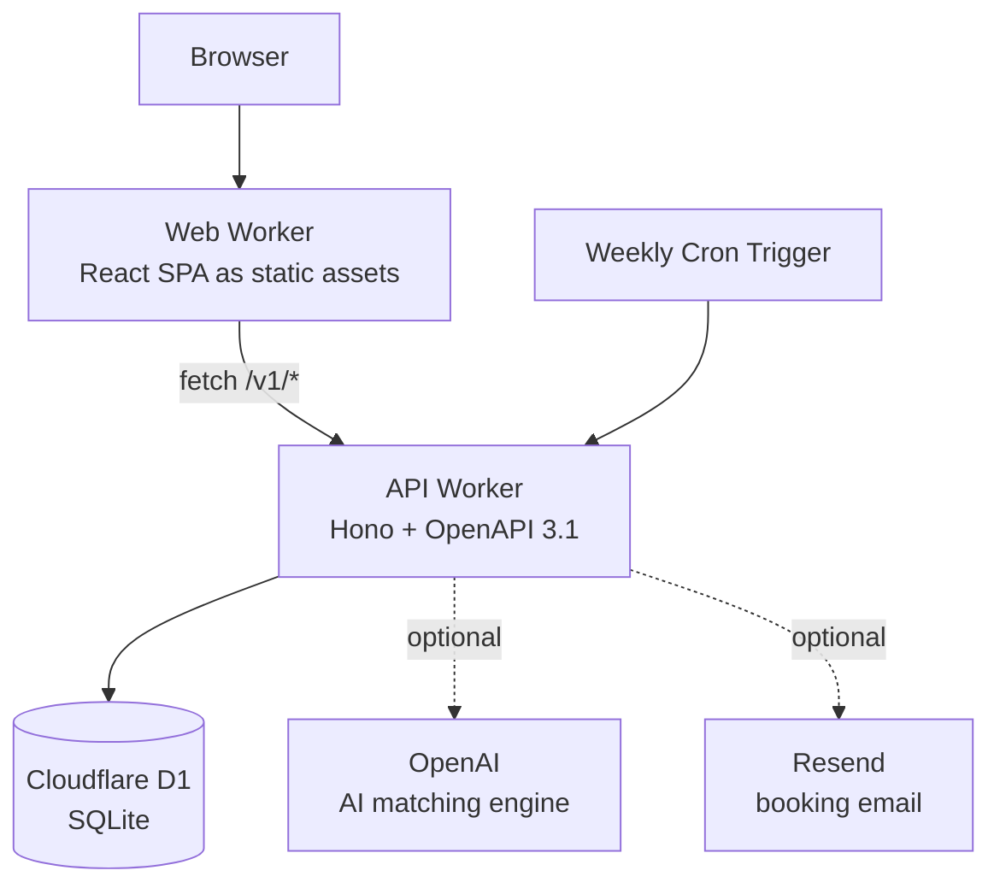

# 2. High Level Architecture

## 2.1 Technical Summary

CF Office Hours runs entirely on Cloudflare as two Workers in one npm-workspaces monorepo:

- An **API Worker** (`cf-office-hours-api`) built with Hono and `@hono/zod-openapi`, serving an OpenAPI 3.1 REST API
  backed by a Cloudflare D1 (SQLite) database accessed through raw prepared statements.
- A **Web Worker** (`cf-office-hours-web`) serving the built React + Vite single-page app as static assets.

Authentication is a Worker-issued session JWT (HS256, signed and verified locally with `jose`); sign-in today is a
role-based demo login. Recommendations come from pluggable matching engines that precompute scores into a cache table
for sub-100ms reads. Booking-confirmation email runs through Resend (logging to console when unconfigured), and a weekly
Cron Trigger re-anchors the demo seed's dates. Shared Zod schemas and types live in `packages/shared`.

## 2.2 Platform and Infrastructure Choice

| Concern        | Choice                                                                                               |
| -------------- | ---------------------------------------------------------------------------------------------------- |
| Compute        | Cloudflare Workers — one Worker for the API, one Worker for the static web app                       |
| Database       | Cloudflare D1 (SQLite), bound to the API Worker as `DB`                                              |
| Web delivery   | Workers static assets (`not_found_handling: single-page-application`), not a separate host           |
| Runtime config | `compatibility_date` `2026-06-01`, `compatibility_flags` `["nodejs_compat"]` (both `wrangler.jsonc`) |
| Environments   | `staging` (`*.workers.dev`) and `production` (custom domains on `youcanjustdothings.io`)             |

The web Worker sets `run_worker_first: ["/assets/*"]` so a request for a missing hashed build asset returns a real `404`
instead of the SPA's `index.html` with the wrong MIME type; every other path takes the static-asset fast path.

## 2.3 Repository Structure

A single npm-workspaces monorepo:

```text
cf-office-hours/
├── apps/
│   ├── api/        # Cloudflare Workers API (Hono + D1)
│   └── web/        # React + Vite SPA (served as Workers static assets)
├── packages/
│   ├── shared/     # Shared Zod schemas and TypeScript types
│   └── config/     # Shared ESLint / TypeScript / build configuration
├── docs/           # This documentation
└── scripts/        # Build and data utilities (seed conversion, date bump)
```

## 2.4 High Level Architecture Diagram


```mermaid
graph TB
    User[Browser] --> Web[Web Worker<br/>React SPA as static assets]
    Web -->|fetch /v1/*| API[API Worker<br/>Hono + OpenAPI 3.1]
    API --> DB[(Cloudflare D1<br/>SQLite)]
    API -.optional.-> OpenAI[OpenAI<br/>AI matching engine]
    API -.optional.-> Resend[Resend<br/>booking email]
    Cron[Weekly Cron Trigger] --> API
```

## 2.5 Architectural Patterns

- **Edge-serverless.** Both halves run as Workers; there is no long-lived application server and no connection pool.
- **Layered backend.** Routes → services → repositories → D1, with strict separation (routes never touch D1; services
  never touch HTTP). See [8. Backend Architecture](./8-backend-architecture.md).
- **Repository pattern.** All D1 access is isolated behind repositories extending a shared `BaseRepository`.
- **Pluggable matching engines.** Match *calculation* is polymorphic behind `IMatchingEngine`; match *retrieval* is a
  plain cache query. See [matching-cache-architecture.md](./matching-cache-architecture.md).
- **Event-driven cache.** Profile/tag/reputation changes fire background recalculation; the UI reads precomputed rows.
- **Contract-first API.** Zod schemas generate the OpenAPI spec, which in turn generates the web app's API types.
- **Client polling for freshness.** The SPA uses React Query polling to keep bookings current; there is no realtime
  socket layer.
