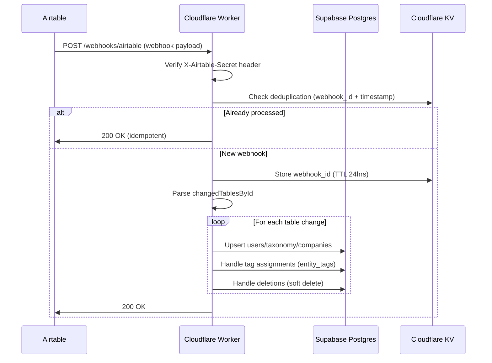

# 4. Data Models

Based on the PRD requirements and database schema design, the following TypeScript interfaces define the core data models/entities that will be shared between frontend and backend. These interfaces will live in `packages/shared` for type safety across the stack.

## 4.1 User & Profile Models

**Purpose:** Represents system users with role-based access and reputation tracking

**Key Attributes:**
- `id`: UUID - Primary identifier
- `airtable_record_id`: string - Stable external reference from Airtable source of truth
- `email`: string - Authentication and communication
- `role`: UserRole enum - Access control (mentee, mentor, coordinator) - **Single role per user in MVP**
- `reputation_score`: number - Calculated value (default 3.5 for cold start per FR47)
- `reputation_tier`: ReputationTier enum - Derived tier (bronze, silver, gold, platinum)
- `is_active`: boolean - Soft delete flag synced from Airtable
- `last_activity_at`: timestamp - Tracks dormancy (90+ days = dormant per FR57)

**TypeScript Interface:**

```typescript
// packages/shared/src/types/user.ts

export enum UserRole {
  Mentee = 'mentee',
  Mentor = 'mentor',
  Coordinator = 'coordinator',
}

export enum ReputationTier {
  Bronze = 'bronze',   // 0-3.0: 2 bookings/week max
  Silver = 'silver',   // 3.0-4.0: 5 bookings/week max
  Gold = 'gold',       // 4.0-4.5: 10 bookings/week max
  Platinum = 'platinum' // 4.5+: Unlimited bookings
}

export interface User {
  id: string;
  airtable_record_id: string;
  email: string;
  role: UserRole;
  reputation_score: number;
  reputation_tier: ReputationTier;
  is_active: boolean;
  last_activity_at: Date;
  created_at: Date;
  created_by: string | null;
  updated_at: Date;
  updated_by: string | null;
  deleted_at: Date | null;
  deleted_by: string | null;
}

export interface UserProfile {
  id: string;
  user_id: string;
  name: string;
  title: string | null;
  portfolio_company_id: string | null; // For employees (FK to portfolio_companies)
  company: string | null; // Free-text for mentors (mutually exclusive with portfolio_company_id)
  phone: string | null;
  expertise_description: string | null; // Mentor-specific
  ideal_mentee_description: string | null; // Mentor-specific
  bio: string | null;
  avatar_url: string | null;
  avatar_source_type: 'upload' | 'url' | null;
  avatar_metadata: AvatarCropSettings | null;
  reminder_preference: ReminderPreference;
  metadata: Record<string, any>; // Experimentation escape hatch
  created_at: Date;
  created_by: string | null;
  updated_at: Date;
  updated_by: string | null;
}

export interface AvatarCropSettings {
  zoom: number;
  pan_x: number;
  pan_y: number;
  rotation: number;
  crop_x: number; // Crop area top-left X coordinate
  crop_y: number; // Crop area top-left Y coordinate
  crop_size: number; // Crop area diameter (circular crop)
}

export enum ReminderPreference {
  OneHour = 'one_hour',
  TwentyFourHours = 'twenty_four_hours',
  Both = 'both',
}

// Combined view for API responses
export interface UserWithProfile extends User {
  profile: UserProfile;
}
```

**Note:** Users can have EITHER `portfolio_company_id` (for employees) OR `company` (for mentors). URLs for users are stored in the `user_urls` table (see Section 4.2).

**Relationships:**
- User → UserProfile (1:1)
- User → UserUrls (1:many)
- User → EntityTags via entity_tags (1:many)
- User → Bookings as mentor/mentee (1:many)
- User → CalendarIntegration (1:1, optional except for non-coordinators per FR105)
- UserProfile → PortfolioCompany (many:1, optional for employees)

## 4.2 Portfolio Company & URL Models

**Purpose:** Manage portfolio companies and user custom URLs

**TypeScript Interface:**

```typescript
// packages/shared/src/types/company.ts

export interface PortfolioCompany {
  id: string;
  name: string;
  description: string | null;
  website: string | null;
  pitch_vc_url: string | null;
  linkedin_url: string | null;
  location: string | null;
  customer_segment: string | null;
  product_type: string | null;
  sales_model: string | null;
  stage: string | null;
  created_at: Date;
  created_by: string | null;
  updated_at: Date;
  updated_by: string | null;
}

// packages/shared/src/types/url.ts

export enum UrlType {
  Website = 'website',
  PitchVc = 'pitch_vc',
  LinkedIn = 'linkedin',
  Other = 'other',
}

export interface UserUrl {
  id: string;
  user_id: string; // FK to users
  url: string;
  url_type: UrlType;
  label: string | null; // For "other" type - custom user-provided label
  created_at: Date;
  created_by: string | null;
  updated_at: Date;
  updated_by: string | null;
}

// Combined view for API responses
export interface UserWithUrls {
  user_id: string;
  urls: Array<{
    id: string;
    url: string;
    url_type: UrlType;
    label: string | null;
  }>;
}
```

**URL Storage Pattern:**
- **Portfolio Companies**: URLs stored directly as columns (website, pitch_vc_url, linkedin_url) - simple, fixed set
- **Users**: URLs stored in `user_urls` table - supports multiple custom URLs per FR7 ("Add link" button)
- No deduplication table needed (premature optimization)

**Relationships:**
- PortfolioCompany → UserProfile (1:many employees)
- PortfolioCompany → EntityTags via entity_tags (1:many)
- UserUrl → User (many:1)

## 4.3 Tag & Taxonomy Models

**Purpose:** Industry/technology/stage categorization for matching and filtering, with coordinator approval workflow for user-requested tags

**Key Attributes:**
- `category`: TagCategory enum - Type of classification (industry, technology, stage)
- `value`: string - **Normalized machine-readable value** (lowercase, underscores, no special chars) - e.g., "cloud_software_infrastructure"
- `display_name`: string - **Original unprocessed value** shown to users - e.g., "Cloud Software & Infrastructure"
- `source`: TagSource enum - Origin of tag (airtable, user, auto_generated, admin, sample_data)
- `is_approved`: boolean - Whether taxonomy entry is approved by coordinators
- `parent_id`: UUID - Enables hierarchical taxonomies
- `requested_by`: UUID - User who requested tag approval (only for source=user)

**TypeScript Interface:**

```typescript
// packages/shared/src/types/tag.ts

export enum TagCategory {
  Industry = 'industry',
  Technology = 'technology',
  Stage = 'stage',
}

export enum TagSource {
  Airtable = 'airtable',        // Synced from Airtable (auto-approved)
  User = 'user',                // User-submitted tag request (requires approval)
  AutoGenerated = 'auto_generated', // System suggested (future AI feature, requires approval)
  Admin = 'admin',              // Coordinator created (auto-approved)
  SampleData = 'sample_data',   // Loaded from SQL sample data (distributed approval for testing)
}

export enum EntityType {
  User = 'user',
  PortfolioCompany = 'portfolio_company',
}

export interface Taxonomy {
  id: string;
  airtable_record_id: string | null; // Null for user-submitted/sample data tags
  category: TagCategory;
  value: string; // Normalized: lowercase_snake_case (e.g., "artificial_intelligence")
  display_name: string; // Original unprocessed value (e.g., "Artificial Intelligence")
  parent_id: string | null; // For hierarchical taxonomies
  is_approved: boolean; // Whether tag is approved for use
  source: TagSource;
  requested_by: string | null; // User ID who requested (only for source=user)
  approved_by: string | null; // Coordinator ID who approved
  requested_at: Date | null;
  approved_at: Date | null;
  created_at: Date;
  created_by: string | null;
  updated_at: Date;
  updated_by: string | null;
}

export interface EntityTag {
  id: string;
  entity_type: EntityType; // 'user' or 'portfolio_company'
  entity_id: string;
  taxonomy_id: string; // FK to taxonomy table
  created_at: Date;
  created_by: string | null;
  updated_at: Date;
  updated_by: string | null;
  deleted_at: Date | null;
  deleted_by: string | null;
}

// Combined view for API responses
export interface EntityWithTags {
  entity_id: string;
  entity_type: EntityType;
  tags: Array<{
    entity_tag_id: string;
    taxonomy_id: string;
    category: TagCategory;
    value: string; // Normalized value
    display_name: string; // Display value
    source: TagSource;
    is_approved: boolean;
  }>;
}
```

**Value Normalization Rules:**
- `value` field: Normalized for deduplication (lowercase, spaces→underscores, special characters removed)
- `display_name` field: Original unprocessed value shown to users in UI
- Example: `display_name="Cloud Software & Infrastructure"` → `value="cloud_software_infrastructure"`
- Normalization prevents duplicate tags with different casing/formatting

**Tag Approval Logic:**
- **Airtable source** (source=airtable): Auto-populated from Airtable, `is_approved=true`, `approved_at` set to creation time, `approved_by=null` (system), `airtable_record_id` populated
- **Sample data source** (source=sample_data): Loaded from SQL seed files for development/testing, `is_approved` distribution: **90% true, 10% false** (simulates pending approval workflow), `approved_at` set to creation time for approved entries, `approved_by=null`, `airtable_record_id=null`
- **Admin source** (source=admin): Coordinator creates tag via admin UI, `is_approved=true` immediately, `approved_by` set to coordinator user_id, `airtable_record_id=null`
- **User source** (source=user): User submits new tag request when selecting non-existent tag, `is_approved=false` initially, `requested_by` set to user_id, `requested_at=NOW()`, becomes approved when coordinator approves
- **Auto-generated source** (source=auto_generated): System suggests tags based on profile/activity (future enhancement), `is_approved=false` until coordinator approves, `airtable_record_id=null`

**Tag Approval Workflow:**
1. User selects tag not in taxonomy → creates new entry with `source=user`, `is_approved=false`
2. System sends notification to all coordinators (creates multiple `notification_log` entries)
3. Coordinator reviews via admin UI → approves or rejects
4. On approval: `is_approved=true`, `approved_at=NOW()`, `approved_by=coordinator_id`
5. Rejected tags remain `is_approved=false` (not deleted, for audit trail)

**Taxonomy Hierarchy:**
- `parent_id` enables hierarchical relationships (e.g., "Edge Computing" → parent: "Cloud Software & Infrastructure")
- Supports multi-level hierarchies for both industries and technologies
- Loaded from sample data SQL seed files during development (see Section 4.8)
- Example hierarchy:
  ```
  Cloud Software & Infrastructure (parent)
    ├── Edge Computing (child)
    ├── Cloud Security (child)
    └── Cloud Analytics (child)
  ```

**Entity Tag Pattern:**
- Polymorphic relationship: `entity_type` + `entity_id` references either `users` or `portfolio_companies`
- `taxonomy_id` references the tag definition in the `taxonomy` table (NOT the normalized value)
- Supports tagging both users (mentors/mentees) and portfolio companies
- Pure junction table with FK to taxonomy for tag definitions
- Unique constraint: `UNIQUE(entity_type, entity_id, taxonomy_id) WHERE deleted_at IS NULL`

**Relationships:**
- Taxonomy → Taxonomy (self-referential for parent hierarchy)
- EntityTag → Taxonomy (many:1)
- EntityTag → User OR PortfolioCompany (polymorphic many:1)

## 4.4 Availability & Booking Models

**Purpose:** Mentor availability scheduling and booking management

**Key Design Notes:**
- Availability blocks define recurring patterns (weekly, monthly, etc.)
- Time slots are generated instances from availability blocks
- **Time Slot Generation Strategy:**
  - Generate slots for next 30 days on availability block save
  - Background job (triggered on coordinator login) generates next 30 days weekly (rolling window)
  - Keeps `time_slots` table manageable (~500 mentors × 4 blocks × 30 slots = 60k rows max)
- Bookings link mentees to specific time slots with meeting details

**TypeScript Interface:**

```typescript
// packages/shared/src/types/availability.ts

export enum RecurrencePattern {
  OneTime = 'one_time',
  Weekly = 'weekly',
  Monthly = 'monthly',
  Quarterly = 'quarterly',
}

export enum MeetingType {
  InPersonPreset = 'in_person_preset',
  InPersonCustom = 'in_person_custom',
  Online = 'online',
}

export interface AvailabilityBlock {
  id: string;
  mentor_id: string;
  recurrence_pattern: RecurrencePattern;
  start_date: string; // ISO date string (YYYY-MM-DD)
  end_date: string | null; // Null for ongoing
  start_time: string; // Time only (HH:MM:SS)
  end_time: string; // Time only (HH:MM:SS)
  slot_duration_minutes: 15 | 20 | 30 | 60;
  buffer_minutes: number;
  meeting_type: MeetingType;
  location_preset_id: string | null;
  location_custom: string | null;
  description: string | null;
  created_at: Date;
  created_by: string | null;
  updated_at: Date;
  updated_by: string | null;
  deleted_at: Date | null;
  deleted_by: string | null;
}

export interface TimeSlot {
  id: string;
  availability_block_id: string;
  mentor_id: string;
  start_time: Date; // Full UTC datetime
  end_time: Date; // Full UTC datetime
  is_booked: boolean;
  booking_id: string | null;
  created_at: Date;
  created_by: string | null;
  updated_at: Date;
  updated_by: string | null;
  deleted_at: Date | null;
  deleted_by: string | null;
}

export enum BookingStatus {
  Pending = 'pending',       // Initial state when booking is created
  Confirmed = 'confirmed',   // Mentor or coordinator has accepted
  Completed = 'completed',   // Meeting has occurred
  Canceled = 'canceled',     // Booking was cancelled
  Expired = 'expired',       // Booking request expired (not confirmed within 7 days)
}

export enum CancellationReason {
  Emergency = 'emergency',
  Reschedule = 'reschedule',
  Other = 'other',
}

export interface Booking {
  id: string;
  time_slot_id: string;
  mentor_id: string;
  mentee_id: string;
  meeting_goal: string; // Required, min 10 chars
  materials_urls: string[];
  meeting_type: MeetingType;
  location: string | null;
  google_meet_link: string | null; // Auto-generated per FR62 (priority: mentee > mentor when both have Google Calendar)
  status: BookingStatus;
  confirmed_by: string | null; // User ID (mentor or coordinator who accepted)
  confirmed_at: Date | null; // When booking was accepted/confirmed
  canceled_by: string | null; // User ID
  canceled_at: Date | null;
  cancellation_reason: CancellationReason | null;
  cancellation_notes: string | null;
  meeting_start_time: Date;
  meeting_end_time: Date;
  created_at: Date;
  created_by: string | null;
  updated_at: Date;
  updated_by: string | null;
  deleted_at: Date | null;
  deleted_by: string | null;
}

// Extended booking with participant details for UI
export interface BookingWithParticipants extends Booking {
  mentor: UserWithProfile;
  mentee: UserWithProfile;
  time_slot: TimeSlot;
}
```

**Booking Status State Machine:**

```
┌─────────┐
│ Pending │ ← Initial state when mentee creates booking
└────┬────┘
     │
     ├─→ [Mentor/Coordinator accepts] ──→ Confirmed
     ├─→ [7 days pass, not confirmed] ──→ Expired (auto-background job)
     └─→ [User cancels] ──────────────→ Canceled
```

**Booking Request Flow & Responsiveness Tracking:**

1. **Initial State**: When mentee creates booking → `status='pending'`, `confirmed_by=null`, `confirmed_at=null`

2. **7-Day Auto-Expiration**: Background job (daily cron) runs:
   ```sql
   UPDATE bookings
   SET status='expired'
   WHERE status='pending'
   AND created_at < NOW() - INTERVAL '7 days'
   ```
   - Expired bookings free up time slots automatically (`time_slots.is_booked=false`)
   - Mentee receives notification that booking expired
   - Mentee can create a new booking for different slot

3. **Confirmation**: When mentor or coordinator accepts:
   - Set `status='confirmed'`
   - Set `confirmed_by=user_id` (mentor or coordinator ID)
   - Set `confirmed_at=NOW()`
   - Send confirmation notification to both parties

4. **Responsiveness Calculation** (for mentor reputation):
   - **Response time** = `confirmed_at - created_at`
   - **Coordinator Exclusion**: If `confirmed_by` is a coordinator, response time is LEFT AS `NULL` (does not affect mentor reputation)
   - **Only mentor confirmations** count toward responsiveness factor
   - Average response time across all mentor-confirmed bookings determines responsiveness multiplier:
     - < 24 hours → 1.2× multiplier
     - 24-48 hours → 1.0× multiplier
     - > 48 hours → 0.8× multiplier

5. **Timeout Cleanup**: Expired bookings:
   - Status changed to `expired`
   - Time slot freed (`time_slots.is_booked=false`)
   - No penalty to mentor reputation (timeout, not rejection)

**Relationships:**
- AvailabilityBlock → TimeSlots (1:many, generated)
- TimeSlot → Booking (1:1, when booked)
- Booking → User (many:1 for mentor, many:1 for mentee)

## 4.5 Reputation & Rating Models

**Purpose:** Track user ratings and calculate reputation scores with tier assignment

**Key Attributes:**
- Ratings are 1-5 star reviews after meetings
- Reputation history tracks score changes and calculation details
- **Mentor-specific exception requests** handle tier restriction bypass per FR54
- **Responsiveness Factor Calculation** (detailed below with booking confirmation flow)

**TypeScript Interface:**

```typescript
// packages/shared/src/types/reputation.ts

export interface Rating {
  id: string;
  booking_id: string;
  rater_id: string; // Who gave the rating
  rated_user_id: string; // Who received the rating
  score: 1 | 2 | 3 | 4 | 5;
  feedback_text: string | null;
  created_at: Date;
  created_by: string | null;
  updated_at: Date;
  updated_by: string | null;
  deleted_at: Date | null;
  deleted_by: string | null;
}

export enum ReputationTrigger {
  RatingReceived = 'rating_received',
  MeetingCompleted = 'meeting_completed',
  MeetingCanceled = 'meeting_canceled',
  AdminOverride = 'admin_override',
}

export interface ReputationCalculationDetails {
  average_rating: number;
  completion_rate: number;
  responsiveness_factor: number; // 0.8×, 1.0×, or 1.2× based on response time
  average_response_time_hours: number | null; // Average time to confirm bookings (hours)
  tenure_bonus: number;
  raw_score: number;
  probationary_clamp_applied: boolean;
  ratings_count: number;
  total_bookings: number;
  confirmed_by_mentor_count: number; // Bookings confirmed by mentor (not coordinator)
}

export interface ReputationHistory {
  id: string;
  user_id: string;
  old_score: number | null;
  new_score: number;
  old_tier: ReputationTier | null;
  new_tier: ReputationTier;
  calculation_details: ReputationCalculationDetails;
  trigger_event: ReputationTrigger;
  created_at: Date;
  created_by: string | null;
  updated_at: Date;
  updated_by: string | null;
}

export enum OverrideStatus {
  Pending = 'pending',
  Approved = 'approved',
  Denied = 'denied',
  Rejected = 'rejected', // Auto-rejected after expiration (different from manually denied)
}

export enum OverrideScope {
  OneTime = 'one_time', // MVP: Single booking with specific mentor within 7 days
}

// NOTE: Tier-based overrides not supported in MVP - only mentor-specific exceptions
export interface TierOverrideRequest {
  id: string;
  mentee_id: string;
  mentor_id: string; // Specific mentor (not tier-based)
  reason: string;
  status: OverrideStatus;
  scope: OverrideScope;
  expires_at: Date; // 7 days from creation (for pending) or 7 days from approval
  used_at: Date | null; // When booking was made using this override
  reviewed_by: string | null; // Coordinator user ID
  reviewed_at: Date | null;
  review_notes: string | null;
  created_at: Date;
  created_by: string | null;
  updated_at: Date;
  updated_by: string | null;
}

// Extended view for coordinator dashboard
export interface TierOverrideRequestWithUsers extends TierOverrideRequest {
  mentee: UserWithProfile;
  mentor: UserWithProfile;
  reviewer: UserWithProfile | null;
}
```

**Tier Override Auto-Rejection (PRD v2.1):**

Background job (daily cron) runs:
```sql
UPDATE tier_override_requests
SET status='rejected',
    review_notes='Auto-rejected: request expired after 7 days'
WHERE status='pending'
AND expires_at < NOW()
```

**Key Rules:**
- **Truly Locked**: Once auto-rejected, requests **cannot be approved** by coordinators
- **Resubmission**: Mentee can always create a **new** tier override request for the same mentor
- **Expiration Timeline**:
  - Pending requests: `expires_at = created_at + 7 days`
  - Approved requests: `expires_at = reviewed_at + 7 days` (7-day booking window starts from approval)

**Optimistic Locking for Override Approvals:**
- Use `UPDATE WHERE status = 'pending'` to prevent duplicate approvals
- First coordinator approval wins
- Second attempt returns 409 Conflict

**Detailed Responsiveness Factor Calculation:**

The responsiveness factor is calculated based on average booking confirmation response time:

**Formula:**
```
Responsiveness Factor =
  if avg_response_time < 24 hours:  1.2×
  if avg_response_time 24-48 hours: 1.0×
  if avg_response_time > 48 hours OR cancellation_rate > 20%: 0.8×
```

**Calculation Query:**
```sql
-- Calculate average response time for mentor (excluding coordinator confirmations)
SELECT
  AVG(EXTRACT(EPOCH FROM (b.confirmed_at - b.created_at)) / 3600) as avg_response_hours,
  COUNT(*) as total_bookings,
  COUNT(*) FILTER (WHERE b.confirmed_by = b.mentor_id) as confirmed_by_mentor,
  COUNT(*) FILTER (WHERE b.status = 'canceled') as canceled_count
FROM bookings b
WHERE b.mentor_id = :mentor_id
  AND b.confirmed_at IS NOT NULL
  AND b.confirmed_by NOT IN (
    -- Exclude confirmations by coordinators (explicit role check)
    SELECT id FROM users WHERE role = 'coordinator'
  )
GROUP BY b.mentor_id
```

**Coordinator Exclusion Rule:**
- If `bookings.confirmed_by` is a coordinator (user with `role='coordinator'`), the response time is **NULL** (excluded from calculation)
- **Explicit role check**: Subquery ensures coordinator confirmations are excluded regardless of user ID
- Only bookings where `confirmed_by = mentor_id` AND confirmer is not a coordinator count toward responsiveness
- This prevents coordinators' white-glove scheduling from penalizing mentor reputation

**Cancellation Rate Penalty:**
- If cancellation rate > 20%, responsiveness factor drops to 0.8× regardless of response time
- Cancellation rate = `canceled_count / total_bookings`

**Complete Reputation Formula (from PRD):**
```
Raw Score = (Average Rating × 0.4) + (Completion Rate × 0.3) +
            (Responsiveness Factor × 0.2) + (Tenure Bonus × 0.1)

Final Score =
  if ratings_count < 3: MIN(raw_score, 3.5)  # Probationary clamp
  else: raw_score

Where:
- Average Rating: Mean of all received ratings (1-5 stars)
- Completion Rate: % of booked sessions attended (vs. canceled/no-show)
- Responsiveness Factor: 0.8×, 1.0×, or 1.2× based on response time
- Tenure Bonus: +0.1 per month active (max +1.0 after 10 months)
```

**Relationships:**
- Rating → Booking (many:1)
- Rating → User as rater (many:1)
- Rating → User as rated (many:1)
- ReputationHistory → User (many:1)
- TierOverrideRequest → User as mentee (many:1)
- TierOverrideRequest → User as mentor (many:1)

## 4.6 Calendar Integration Models

**Purpose:** OAuth calendar connectivity for Google/Microsoft calendars per FR21/FR105

**Key Attributes:**
- OAuth tokens and refresh tokens for calendar API access
- Multi-calendar support (select which calendars to read/write)
- Connection method tracks OAuth signup vs post-login connection

**TypeScript Interface:**

```typescript
// packages/shared/src/types/calendar.ts

export enum CalendarProvider {
  Google = 'google',
  Microsoft = 'microsoft',
}

export enum ConnectionMethod {
  OAuthSignup = 'oauth_signup',     // FR2: Combined auth + calendar during signup
  PostLogin = 'post_login',         // Magic link users connect post-auth
}

export interface CalendarInfo {
  id: string;
  name: string;
  is_primary: boolean;
  color: string | null;
}

export interface CalendarIntegration {
  id: string;
  user_id: string;
  provider: CalendarProvider;
  access_token: string; // Encrypted at rest
  refresh_token: string; // Encrypted at rest
  token_expires_at: Date;
  granted_scopes: string[]; // OAuth scopes granted
  connection_method: ConnectionMethod;
  is_connected: boolean;
  available_calendars: CalendarInfo[];
  write_calendar_id: string | null; // Which calendar to create events in
  read_calendar_ids: string[]; // Which calendars to check for conflicts
  last_sync_at: Date | null;
  created_at: Date;
  created_by: string | null;
  updated_at: Date;
  updated_by: string | null;
}

// API response for calendar sync status
export interface CalendarSyncStatus {
  is_connected: boolean;
  provider: CalendarProvider | null;
  last_sync_at: Date | null;
  calendars_count: number;
}
```

**Relationships:**
- CalendarIntegration → User (1:1, unique constraint per user in MVP)

## 4.7 Notification & Audit Models

**Purpose:** Track notification delivery and admin actions for compliance

**TypeScript Interface:**

```typescript
// packages/shared/src/types/notification.ts

export enum NotificationType {
  BookingConfirmed = 'booking_confirmed',
  BookingCancelled = 'booking_cancelled',
  BookingReminder = 'booking_reminder',
  RatingRequest = 'rating_request',
  TierChanged = 'tier_changed',
  MentorReachOut = 'mentor_reach_out',
  OverrideApproved = 'override_approved',
  OverrideRejected = 'override_rejected',
  TagApprovalPending = 'tag_approval_pending',
}

export enum DeliveryChannel {
  Email = 'email',
  Toast = 'toast',
  Both = 'both',
}

export enum DeliveryStatus {
  Sent = 'sent',
  Failed = 'failed',
}

export interface NotificationLog {
  id: string;
  notification_type: NotificationType;
  recipient_id: string;
  delivery_channel: DeliveryChannel;
  delivery_status: DeliveryStatus;
  error_message: string | null;
  metadata: Record<string, any>; // booking_id, mentor_id, etc.
  sent_at: Date | null;
  created_at: Date;
  created_by: string | null;
  updated_at: Date;
  updated_by: string | null;
}

export interface AuditLog {
  id: string;
  action_type: string; // 'reputation_override', 'meeting_canceled', etc.
  admin_user_id: string;
  target_entity_type: string; // 'booking', 'user', etc.
  target_entity_id: string;
  before_value: Record<string, any> | null;
  after_value: Record<string, any> | null;
  reason: string | null;
  created_at: Date;
  created_by: string | null;
  updated_at: Date;
  updated_by: string | null;
}
```

**Coordinator Broadcast Notification Pattern:**

When notifications need to be sent to **all coordinators** (e.g., `tag_approval_pending`, `tier_override_requested`), the system:

1. Queries `users` table WHERE `role='coordinator'` to get all coordinator IDs
2. Creates **multiple `notification_log` entries** (one per coordinator):
   ```sql
   INSERT INTO notification_log (notification_type, recipient_id, delivery_channel, metadata)
   SELECT 'tag_approval_pending', id, 'email', '{"tag_id": "xxx"}'::jsonb
   FROM users
   WHERE role = 'coordinator' AND is_active = true
   ```
3. No notification groups or distribution lists in MVP (keeps implementation simple)

**Example Use Cases:**
- User requests new taxonomy tag → notify all coordinators
- Mentee requests tier override → notify all coordinators
- System detects anomaly → notify all coordinators

**Relationships:**
- NotificationLog → User (many:1 recipient)
- AuditLog → User (many:1 admin)

## 4.8 Sample Data & Seed Scripts

**Purpose:** Provide comprehensive sample data for local development and testing environments. All sample data is hard-coded in SQL seed files located in `supabase/seeds/` and is **never used in production**.

### 4.8.1 Taxonomy Sample Data

**Files:**
- `supabase/seeds/01_seed_industries.sql` - Industry taxonomy with hierarchical relationships (55 records)
- `supabase/seeds/02_seed_technologies.sql` - Technology taxonomy with hierarchical relationships (45 records)

**SQL Format:**
```sql
TRUNCATE TABLE raw_industries;
INSERT INTO raw_industries (name, parent) VALUES
  ('Cloud Software & Infrastructure', NULL),
  ('Edge Computing', 'Cloud Software & Infrastructure'),
  ('Cloud Security', 'Cloud Software & Infrastructure'),
  ('Artificial Intelligence', NULL),
  ('Machine Learning', 'Artificial Intelligence'),
  ('Natural Language Processing', 'Artificial Intelligence');
```

**Column Definitions:**
- `name`: Display name (original unprocessed value shown to users)
- `parent`: Optional parent taxonomy entry name (for hierarchical relationships, NULL for top-level)

**Data Structure:**
- Data is hard-coded directly in SQL INSERT statements
- Multi-value INSERT syntax used for efficiency
- Hierarchical relationships via parent column (child entries reference parent name as string)
- All data loaded into `raw_*` tables for ETL processing in Epic 5

**Loading Process:**

1. **Direct SQL Loading**: Data loaded via `supabase db reset` command
   - Seeds execute in numbered order (01, 02, etc.)
   - TRUNCATE ensures idempotency
   - No normalization needed - data pre-formatted in SQL

2. **Hierarchy**: Parent entries listed first, then child entries in SQL file
   - Parents have `parent = NULL`
   - Children have `parent = 'Parent Name'`
   - ETL process (Epic 5) will resolve parent_id relationships

3. **Future ETL Process** (Epic 5):
   - Transform raw_industries → taxonomy table
   - Normalize values: `display_name` = original, `value` = normalized (lowercase, underscores)
   - Resolve parent_id foreign keys
   - Apply approval distribution: 90% true, 10% false (for testing)
   - Set `source='sample_data'`, `airtable_record_id=null`

### 4.8.2 User/Mentor Sample Data

**File:** `supabase/seeds/06_seed_mentors.sql`

**SQL Format:**
```sql
TRUNCATE TABLE raw_mentors;
INSERT INTO raw_mentors (name, bio, industry_expertise, technology_expertise) VALUES
  ('Sarah Mentor', 'VP of Product at TechCorp. 15+ years building SaaS products.', 'Cloud Software & Infrastructure,SaaS', 'Artificial Intelligence,Machine Learning')
Mike Advisor,"Partner at Venture Capital Firm. Focus on FinTech investments.","FinTech,Enterprise Software","Cloud Security,Blockchain"
```

**Column Definitions:**
- `Full Name`: User's display name (loaded into `user_profiles.name`)
- `Bio`: User bio (loaded into `user_profiles.bio`)
- `Industry Expertise`: Comma-separated list of industry tags (matches `taxonomy.display_name`)
- `Technology Expertise`: Comma-separated list of technology tags (matches `taxonomy.display_name`)

**Loading Process:**

1. Create user in `users` table with `role='mentor'`, default reputation
2. Create profile in `user_profiles` table
3. Parse comma-separated expertise columns
4. Match against normalized `taxonomy.value` (not display_name)
5. Create `entity_tags` entries linking to taxonomy IDs:
   ```sql
   INSERT INTO entity_tags (entity_type, entity_id, taxonomy_id)
   SELECT 'user', :user_id, id
   FROM taxonomy
   WHERE value IN ('cloud_software_infrastructure', 'saas', 'artificial_intelligence', 'machine_learning')
     AND is_approved = true
   ```

### 4.8.3 Portfolio Company Sample Data

**File:** `supabase/seeds/03_seed_portfolio_companies.sql`

**SQL Format:**
```sql
TRUNCATE TABLE raw_portfolio_companies;
INSERT INTO raw_portfolio_companies (name, description, website, pitch_url, location, industry, technology, stage, customer_segment, product_type, sales_model) VALUES
  ('TechStartup Inc', 'AI-powered analytics platform', 'https://techstartup.com', 'https://pitch.vc/techstartup', 'Austin, TX', 'SaaS,Cloud Software & Infrastructure', 'Artificial Intelligence,Machine Learning', 'Series A', 'B2B', 'Software', 'Subscription')
```

**Column Definitions:**
- `Name`: Company name (loaded into `portfolio_companies.name`)
- `Description`: Company description
- `Website`, `Pitch`: URLs (loaded directly into `portfolio_companies.website` and `portfolio_companies.pitch_vc_url`)
- `Location`, `Industry`, `Technology`, `Stage`, etc.: Metadata and tags

**Loading Process:**

1. Create portfolio company in `portfolio_companies` table with URL columns:
   ```sql
   INSERT INTO portfolio_companies (name, description, website, pitch_vc_url, location, ...)
   VALUES ('TechStartup Inc', 'AI-powered analytics', 'https://techstartup.com', 'https://pitch.vc/techstartup', 'Austin, TX', ...);
   ```
2. Parse comma-separated tag columns (Industry, Technology, Stage)
3. Create `entity_tags` entries linking to taxonomy

### 4.8.4 Production-Safe Seed Data

**File:** `seeds/locations.sql`

**Purpose:** Location presets for in-person meetings (CF offices, coffee shops, etc.)

**Example:**
```sql
INSERT INTO locations (id, name, address, location_type, is_active)
VALUES
  (gen_random_uuid(), 'CF Office - Austin 4th Floor', '701 Brazos St, Austin, TX', 'office', true),
  (gen_random_uuid(), 'CF Office - Austin Rooftop', '701 Brazos St, Austin, TX', 'office', true),
  (gen_random_uuid(), 'Coffee Shop - TBD', null, 'coffee_shop', true)
ON CONFLICT DO NOTHING;
```

**Production Safety:** This seed file is safe to run in production (idempotent, essential data).

### 4.8.5 Seed Script Organization

**Directory Structure:**
```
/supabase/seeds/                # Database seed scripts (SQL)
  ├── 01_seed_industries.sql    # Industry taxonomy with hierarchy (dev only)
  ├── 02_seed_technologies.sql  # Technology taxonomy with hierarchy (dev only)
  ├── 03_seed_portfolio_companies.sql # Sample portfolio companies (dev only)
  ├── 04_seed_mentees.sql       # Sample mentee profiles (dev only)
  ├── 05_seed_users.sql         # Coordinator/admin users (dev only)
  ├── 06_seed_mentors.sql       # Sample mentor profiles (dev only)
  └── README.md                 # Seeding instructions
```

### 4.8.6 Execution Strategy

**Development (`npm run dev:setup`):**
```bash
# Auto-run on dev setup
npm run dev:setup
  → Check if AIRTABLE_API_KEY exists
  → If NOT exists: Run all sample data scripts
  → If exists: Skip sample data (use Airtable sync)
```

**SQL Seed Execution:**
```bash
# Automatic execution via Supabase CLI
supabase db reset

# Seeds execute in order:
# 01_seed_industries.sql → TRUNCATE + INSERT into raw_industries
# 02_seed_technologies.sql → TRUNCATE + INSERT into raw_technologies
# 03_seed_portfolio_companies.sql → TRUNCATE + INSERT into raw_portfolio_companies
# 04_seed_mentees.sql → TRUNCATE + INSERT into raw_mentees
# 05_seed_users.sql → TRUNCATE + INSERT into raw_users
# 06_seed_mentors.sql → TRUNCATE + INSERT into raw_mentors
```

**Seed File Pattern:**
```sql
-- Example: 01_seed_industries.sql
TRUNCATE TABLE raw_industries;
INSERT INTO raw_industries (name, parent) VALUES
  ('Industry 1', NULL),
  ('Child Industry', 'Industry 1'),
  ('Industry 2', NULL);
```

**Key Features:**
- TRUNCATE ensures idempotency (safe to re-run)
- All data hard-coded in SQL (no external file dependencies)
- Individual INSERT statements for complex data (mentors, companies)
- Multi-value INSERT for simple data (industries, technologies)
- All tracked in version control

**Production:**
- **DO NOT** run sample data seed files in production
- Sample seeds are development/testing only
- Rely on Airtable sync for taxonomy, users, and portfolio companies in production
- Document in deployment guide: "Never run numbered seed files (01-06) in production"

### 4.8.7 Development Workflow

1. Developer clones repo
2. Runs `supabase db reset`
3. Seeds auto-load sample data into raw tables
4. Developer has realistic data for local testing (90% approved tags, 10% pending for testing approval flow)
5. When ready for production testing → configure Airtable sync, sample data replaced

## 4.9 Edge Case Handling

**User Deletion (Airtable Sync):**
- Soft delete user (`is_active = false`)
- Send notification to BOTH parties + coordinators
- **24-hour undo window:** Coordinator can manually reactivate
- After 24hrs, meetings auto-cancel permanently

**Rating After User Deletion:**
- Deleted users (`deleted_at IS NOT NULL`) cannot submit ratings
- Other parties in the meeting can still rate the deleted user

**Mutual Availability Indicator:**
- Best-effort indication (not guarantee)
- Booking confirmation checks BOTH calendars via API (FR106)
- If conflict detected: Show error, remove ⭐ indicator, refresh slot list
- User picks different slot

## 4.10 External System Integration

This section documents the integration with external systems, specifically the **Airtable webhook synchronization** that maintains user data and taxonomy as the source of truth.

### 4.10.1 Airtable as Source of Truth

**Overview:**
Airtable serves as the **external source of truth** for:
- User data (mentors, mentees, coordinators)
- CF taxonomy (industries, technologies, stages)
- Portfolio companies

The application syncs data via **webhooks** triggered on CRUD operations in Airtable. This one-way sync ensures data consistency while keeping the operational database (Supabase Postgres) optimized for real-time queries.

**Key Principles:**
- **One-way sync**: Airtable → Application (no reverse sync)
- **Webhook-driven**: Real-time updates on Airtable changes
- **Idempotent upserts**: Same webhook can be processed multiple times safely
- **Stable IDs**: `airtable_record_id` acts as the join key between systems
- **Graceful degradation**: Application continues operating if Airtable is temporarily unavailable

### 4.10.2 Airtable Data Schema

**Users Table (Airtable):**
- Record ID (unique identifier)
- Email (text, required)
- Role (single select: mentee, mentor, coordinator)
- Name (text)
- Title (text)
- Company (text) - For mentors; mutually exclusive with Portfolio Company link
- Portfolio Company (linked record) - For employees/mentees
- Phone (phone number)
- LinkedIn URL (URL)
- Industries (multi-select)
- Technologies (multi-select)
- Stage (multi-select)

**Taxonomy Tables (Airtable):**
Three separate tables or tabs:
- **Industries** (Name, Parent)
- **Technologies** (Name, Parent)
- **Stages** (Name)

**Portfolio Companies Table (Airtable):**
- Record ID
- Name (text, required)
- Description (long text)
- Website (URL)
- Pitch.vc URL (URL)
- LinkedIn URL (URL)
- Location (text)
- Customer Segment (text)
- Product Type (text)
- Sales Model (text)
- Stage (text)

### 4.10.3 Field Mapping Table

**User Data Mapping:**

| Airtable Field | Target Table | Target Column | Required | Type | Notes |
|---------------|--------------|---------------|----------|------|-------|
| Record ID | `users` | `airtable_record_id` | Yes | text | Stable join key |
| Email | `users` | `email` | Yes | text | Unique identifier |
| Role | `users` | `role` | Yes | enum | Values: `mentee`, `mentor`, `coordinator` |
| Name | `user_profiles` | `name` | No | text | Display name |
| Title | `user_profiles` | `title` | No | text | Job title |
| Company | `user_profiles` | `company` | No | text | Free-text for mentors only |
| Portfolio Company | `user_profiles` | `portfolio_company_id` | No | uuid | FK lookup via Airtable Record ID |
| Phone | `user_profiles` | `phone` | No | text | Contact phone number |
| LinkedIn URL | `user_urls` | `url` | No | text | Stored with `url_type='linkedin'` |
| Industries | `entity_tags` via `taxonomy` | Multiple rows | No | multi-select | Creates one `entity_tags` row per industry via `taxonomy_id` lookup |
| Technologies | `entity_tags` via `taxonomy` | Multiple rows | No | multi-select | Creates one `entity_tags` row per technology via `taxonomy_id` lookup |
| Stage | `entity_tags` via `taxonomy` | Multiple rows | No | multi-select | Creates one `entity_tags` row per stage via `taxonomy_id` lookup |

**Unrecognized Columns:**
- Logged as warnings (per NFR32)
- Ignored (no error thrown)
- Enables Airtable schema evolution without breaking sync

**Taxonomy Data Mapping:**

| Airtable Field | Target Table | Target Column | Notes |
|---------------|--------------|---------------|-------|
| Record ID | `taxonomy` | `airtable_record_id` | Stable join key |
| Name | `taxonomy` | `display_name` | Original value (e.g., "Cloud Software & Infrastructure") |
| Name (normalized) | `taxonomy` | `value` | Lowercase snake_case (e.g., "cloud_software_infrastructure") |
| Parent | `taxonomy` | `parent_id` | FK lookup via Airtable Record ID |
| (implicit) | `taxonomy` | `category` | Set based on source table (industries/technologies/stages) |
| (implicit) | `taxonomy` | `source` | Always `'airtable'` |
| (implicit) | `taxonomy` | `is_approved` | Always `true` (Airtable is trusted source) |

**Portfolio Company Mapping:**

| Airtable Field | Target Table | Target Column | Notes |
|---------------|--------------|---------------|-------|
| Record ID | `portfolio_companies` | `airtable_record_id` | Stable join key |
| Name | `portfolio_companies` | `name` | Required, unique |
| Description | `portfolio_companies` | `description` | Long text |
| Website | `portfolio_companies` | `website` | Direct column storage |
| Pitch.vc URL | `portfolio_companies` | `pitch_vc_url` | Direct column storage |
| LinkedIn URL | `portfolio_companies` | `linkedin_url` | Direct column storage |
| Location | `portfolio_companies` | `location` | Text field |
| Customer Segment | `portfolio_companies` | `customer_segment` | Text field |
| Product Type | `portfolio_companies` | `product_type` | Text field |
| Sales Model | `portfolio_companies` | `sales_model` | Text field |
| Stage | `portfolio_companies` | `stage` | Text field |

### 4.10.4 Webhook Configuration

**Airtable Webhook Setup:**
1. Navigate to Airtable Automations
2. Create automation: "When record created/updated/deleted"
3. Trigger: Any table change (Users, Industries, Technologies, Stages, Portfolio Companies)
4. Action: Send to webhook
5. URL: `https://api.cf-oh.youcanjustdothings.io/webhooks/airtable`
6. Method: POST
7. Headers:
   ```json
   {
     "Content-Type": "application/json",
     "X-Airtable-Secret": "{{AIRTABLE_WEBHOOK_SECRET}}"
   }
   ```

**Webhook Payload Structure:**
```json
{
  "timestamp": "2025-10-03T14:30:00.000Z",
  "base": {
    "id": "appXXXXXXXXXXXXXX"
  },
  "webhook": {
    "id": "achXXXXXXXXXXXXXX"
  },
  "changedTablesById": {
    "tblUsers": {
      "createdRecordsById": {
        "recXXXX": {
          "id": "recXXXX",
          "createdTime": "2025-10-03T14:30:00.000Z",
          "fields": {
            "Email": "john@example.com",
            "Role": "mentor",
            "Name": "John Doe",
            "Industries": ["Cloud Software", "FinTech"],
            "Technologies": ["React", "Node.js"]
          }
        }
      },
      "changedRecordsById": {
        "recYYYY": {
          "current": { "fields": { "Name": "Jane Smith Updated" } },
          "previous": { "fields": { "Name": "Jane Smith" } },
          "unchanged": { "fields": { "Email": "jane@example.com" } }
        }
      },
      "destroyedRecordIds": ["recZZZZ"]
    }
  }
}
```

### 4.10.5 Webhook Processing Flow

**High-Level Flow:**



**Detailed Processing Steps:**

1. **Authentication & Validation** (per FR108):
   ```typescript
   const secret = request.headers.get('X-Airtable-Secret');
   if (secret !== env.AIRTABLE_WEBHOOK_SECRET) {
     return new Response('Unauthorized', { status: 401 });
   }
   ```

2. **Deduplication Check** (prevent double-processing):
   ```typescript
   const webhookKey = `webhook:${payload.webhook.id}:${payload.timestamp}`;
   const exists = await env.CACHE.get(webhookKey);
   if (exists) {
     return new Response('Already processed', { status: 200 });
   }
   await env.CACHE.put(webhookKey, '1', { expirationTtl: 86400 }); // 24hrs
   ```

3. **Process Record Changes**:
   - **Created Records**: Insert new rows with `airtable_record_id`
   - **Changed Records**: Upsert using `airtable_record_id` as stable key
   - **Destroyed Records**: Soft delete (`is_active=false`, `deleted_at=NOW()`)

4. **Handle Taxonomy Sync** (with dependency ordering):
   ```typescript
   // CRITICAL: Sync portfolio companies BEFORE users
   // (Airtable enforces company must exist before user assignment)

   if (payload.changedTablesById['tblPortfolioCompanies']) {
     await syncPortfolioCompanies(payload);
   }

   if (payload.changedTablesById['tblIndustries']) {
     await syncTaxonomy(payload, 'industry');
   }

   if (payload.changedTablesById['tblTechnologies']) {
     await syncTaxonomy(payload, 'technology');
   }

   if (payload.changedTablesById['tblStages']) {
     await syncTaxonomy(payload, 'stage');
   }

   // Users LAST (depends on companies and taxonomy)
   if (payload.changedTablesById['tblUsers']) {
     await syncUsers(payload);
   }
   ```

5. **Taxonomy Hierarchy Resolution**:
   ```typescript
   async function syncTaxonomy(payload, category) {
     // PASS 1: Insert parent entries (where Parent field is empty)
     const parents = records.filter(r => !r.fields.Parent);
     await db.insert(parents.map(p => ({
       airtable_record_id: p.id,
       category,
       value: normalizeTaxonomyValue(p.fields.Name),
       display_name: p.fields.Name,
       parent_id: null,
       is_approved: true,
       source: 'airtable',
     })));

     // PASS 2: Insert child entries (with parent_id lookup)
     const children = records.filter(r => r.fields.Parent);
     for (const child of children) {
       const parent = await db.findOne({
         airtable_record_id: child.fields.Parent
       });
       await db.insert({
         airtable_record_id: child.id,
         category,
         value: normalizeTaxonomyValue(child.fields.Name),
         display_name: child.fields.Name,
         parent_id: parent.id,
         is_approved: true,
         source: 'airtable',
       });
     }
   }
   ```

6. **User Tag Assignment**:
   ```typescript
   async function assignUserTags(userId, airtableFields) {
     // Clear existing Airtable-sourced tags
     await db.delete('entity_tags', {
       entity_type: 'user',
       entity_id: userId,
       taxonomy_id: db.subquery('taxonomy', { source: 'airtable' })
     });

     // Insert new tags from Airtable
     const industries = airtableFields.Industries || [];
     const technologies = airtableFields.Technologies || [];
     const stages = airtableFields.Stage || [];

     for (const tagName of [...industries, ...technologies, ...stages]) {
       const taxonomy = await db.findOne('taxonomy', {
         display_name: tagName,
         source: 'airtable'
       });

       if (taxonomy) {
         await db.insert('entity_tags', {
           entity_type: 'user',
           entity_id: userId,
           taxonomy_id: taxonomy.id,
         });
       } else {
         console.warn(`Tag not found in taxonomy: ${tagName}`);
       }
     }
   }
   ```

7. **URL Handling**:
   ```typescript
   async function syncUserUrls(userId, linkedinUrl) {
     if (!linkedinUrl) return;

     await db.upsert('user_urls', {
       user_id: userId,
       url_type: 'linkedin',
       url: linkedinUrl,
     }, {
       onConflict: ['user_id', 'url_type'],
       update: { url: linkedinUrl, updated_at: new Date() }
     });
   }
   ```

### 4.10.6 Error Handling & Retry Strategy

**Transient Failures:**
- Airtable webhook will **retry automatically** on 5xx errors
- Worker returns 500 → Airtable retries with exponential backoff
- Max 3 retries before marking webhook delivery failed

**Permanent Failures:**
- Missing required fields (e.g., Email) → Log error, skip record, return 200 OK
- Invalid enum values → Log warning, use default, return 200 OK
- Constraint violations → Log error, skip record, return 200 OK

**Monitoring:**
- All webhook errors logged to Cloudflare Workers Logs
- Alert coordinator if >5 webhook failures in 1 hour (future enhancement)

**Idempotency:**
- Upsert operations keyed by `airtable_record_id`
- Deduplication via KV cache prevents double-processing
- Safe to retry manually if needed

### 4.10.7 Development vs Production Sync

**Development Environment:**
- **NO Airtable sync** (uses sample data from SQL seeds)
- Check for `AIRTABLE_WEBHOOK_SECRET` env var:
  ```typescript
  if (!env.AIRTABLE_WEBHOOK_SECRET) {
    console.log('Airtable sync disabled - using sample data');
    return;
  }
  ```
- Sample data loaded via `npm run dev:setup`

**Production Environment:**
- **Airtable webhook enabled**
- Initial sync via manual Airtable script export (one-time)
- Ongoing sync via webhooks (real-time)

**Initial Production Data Load:**
1. Export Airtable data to JSON
2. Run one-time migration script: `npm run migrate:airtable-initial`
3. Configure Airtable webhooks
4. System maintains sync via webhooks

### 4.10.8 Sync Dependency Graph

**Dependency Order (CRITICAL for referential integrity):**

```
Portfolio Companies (no dependencies)
  ↓
Taxonomy (no dependencies)
  ↓
Users (depends on Portfolio Companies for portfolio_company_id lookup)
  ↓
User Profiles (depends on Users)
  ↓
User URLs (depends on Users)
  ↓
Entity Tags (depends on Users + Taxonomy)
```

**Implementation:**
Process webhook tables in this order:
1. `tblPortfolioCompanies`
2. `tblIndustries`, `tblTechnologies`, `tblStages` (parallel)
3. `tblUsers`

**Race Condition Prevention:**
- Use database transactions for multi-table updates
- Taxonomy parent-child relationships processed in two passes
- Foreign key constraints enforce referential integrity

---
